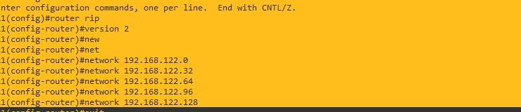

# TOPOLOGIA 3

### CONFIGURACIONES PARA EL ROUTER
configuramos las 2 interfaces del router c3725
```python
configure t
interface fastEthernet 0/0
no shutdown
exit

configure t
interface fastEthernet 0/1
no shutdown
exit
```


### CONFIGURACION DE ROUTER ON STICK

en la ip address va una ip perteneciente al rango de ips la cual sera tomada como gateway.

```java
// vlan 10
configure t
int fa0/0.10
encapsulation dot1Q 10
ip address 192.168.122.30 255.255.255.224
no shutdown 
exit

// vlan 20 
int fa0/0.20
encapsulation dot1Q 20
ip address  192.168.122.62 255.255.255.224
no shutdown 
exit
// vlan 30
int fa0/0.30
encapsulation dot1Q 30
ip address  192.168.122.94 255.255.255.224
no shutdown 
exit
// vlan 40
int fa0/0.40
encapsulation dot1Q 40
ip address 192.168.122.126 255.255.255.224
no shutdown 
exit

//       vlan 50
int fa0/0.50
encapsulation dot1Q 50
ip address  192.168.122.158 255.255.255.224
no shutdown
exit

//                   comprobacion

exit
show ip interface brief
exit

//  guardamos las configuraciones

copy running-config startup-config
wr

```

### configuracion de DHCP
en esta topologia solo se pidio dhcp para la vlan 10 de administracion.
```python
configure t
ip dhcp pool VLAN10
network 192.168.122.0 /27
default-router 192.168.122.30
exit

# LOS EXCLUDED-ADDRRRESS (para las gateways)
ip dhcp excluded-address 192.168.122.29 192.168.122.30            la ultima es la gateway   por eso la guardo
exit
wr

# para ver los equipos con una ip proporcionada por el DHCP

show ip dhcp binding


```

## CONFIGURACION DE ROUTER RIP


## CONFIGURACION DEL ETHERSWITCH

```java

// configuracion VTP aunque no es necesrio
configure terminal
vtp domain Grupo22
vtp password Grupo22
vtp mode server
end

// CREACION DE VLANS

configure terminal
vlan 10
name ADMINISTRACION
exit
vlan 20
name DATABASE
exit
vlan 30
name VENTAS
exit
vlan 40
name RRHH
exit
vlan 50
name CONTABILIDAD
exit

end

//      COMPROBACION DE VLANS

show vlan-sw


```

## CONFIGURANDO LOS FASTETHERNET
- modo truncal hacia el switch
- modo acceso hacia hosts

```java 

// TRONCAL
conf t
int f#/#      o bien     int Po#
switchport mode trunk
switchport trunk allowed vlan 1,10,20,30,40,50,1002-1005
end


// ACCESO
conf t
int f#/#
switchport mode access
switchport access vlan #
end


// GUARDAMOS CONFIGURACIONES

wr
copy running-config startup-config

```


# CONFIGURACION DE IPS

``` java
// oara las vpcs de administacion
ip dhcp

```

<div align="center">
    <p align="center">
        Figura 1. TOPOLOGIA COMPLETA
    </p>
    
</div>


<div align="center">
    <p align="center">
        Figura 2. SUBINTERFACES AL INICIO
    </p>
    
</div>

<div align="center">
    <p align="center">
        Figura 3. despues de configurar
    </p>
    
</div>


<div align="center">
    <p align="center">
        Figura 4. despues de configurar
    </p>
    
</div>

<div align="center">
    <p align="center">
        Figura 5. solicitando el DHCP
    </p>
    
</div>

<div align="center">
    <p align="center">
        Figura 6.comando para correr las paginas webs
    </p>
    
</div>

<div align="center">
    <p align="center">
        Figura 7. ir a las respectivas ips y poner el puerto 3000 para visualizar la pagina
    </p>
    
</div>

<div align="center">
    <p align="center">
        Figura 8. ir a las respectivas ips y poner el puerto 3000 para visualizar la pagina
    </p>
    
</div>


<div align="center">
    <p align="center">
        Figura 8. CONFIGURACION DE RIP
    </p>
    
</div>

